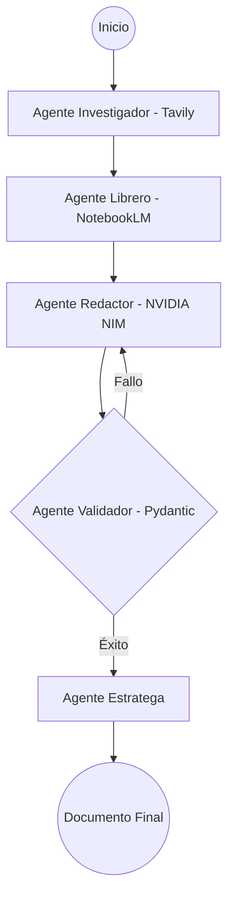

# 🤖 Arquitectura y Funciones del Ecosistema de Agentes de IA

Este documento detalla el funcionamiento interno de la orquestación de IA para **MUNify**, utilizando **LangGraph** para el flujo, **Pydantic** para la estructura de datos y múltiples herramientas (Tools) para la investigación y redacción.

---

## 1. El Flujo de Trabajo (LangGraph)

A diferencia de un chat convencional, MUNify utiliza un **Grafo Acíclico Dirigido (DAG)** donde cada nodo es un agente especialista. El flujo no es lineal; si un documento no pasa la validación, el grafo puede retroceder al nodo de redacción.



---

## 2. Definición Detallada de Agentes

### 🔍 A. Agente Investigador (The Researcher)
*   **Función:** Proporcionar contexto geopolítico de "último minuto".
*   **Herramienta Principal:** **Tavily Web Search API**.
*   **Responsabilidades:**
    *   Buscar noticias sobre el tema del comité publicadas en las últimas 24-48 horas.
    *   Identificar discursos recientes de jefes de estado o embajadores del país asignado.
    *   Extraer datos estadísticos recientes (PNUD, Banco Mundial, etc.) para sustentar argumentos.
*   **Output:** Un dataset estructurado de hechos y noticias ("Facts & News").

### 📚 B. Agente de Contexto Profundo / Librero (The Librarian)
*   **Función:** Realizar RAG (Retrieval-Augmented Generation) sobre bases de conocimiento masivas y estáticas.
*   **Herramienta Principal:** **NotebookLM Python API**.
*   **Responsabilidades:**
    *   Consultar la "Carta de las Naciones Unidas" y reglamentos internos (HNMUN, WorldMUN).
    *   Extraer párrafos exactos de resoluciones históricas previas sobre el mismo tema.
    *   Cruzar información de tratados firmados y ratificados por el país (para evitar contradicciones legales).
*   **Output:** Listado de citas legales y precedentes diplomáticos ("Citations & Precedents").

### ✍️ C. Agente Redactor Diplomático (The Scribe)
*   **Función:** Transformar el contexto y la investigación en prosa diplomática.
*   **Herramienta Principal:** **NVIDIA NIM** (Optimizado con Llama 3 70B o Mixtral 8x22B).
*   **Responsabilidades:**
    *   Redactar cláusulas **Preambulatorias** (Verbos en participio, ej: *Reconociendo*, *Preocupado por*).
    *   Redactar cláusulas **Operativas** (Verbos en imperativo, ej: *Exhorta*, *Condena*, *Decide*).
    *   Asegurar que el tono sea neutral y evite la primera persona ("Yo creo" o "Mi país siente").
*   **Output:** Borrador estructurado del documento.

### ⚖️ D. Agente Validador de Protocolo (The Grammarian)
*   **Función:** Control de calidad y cumplimiento de formato estricto.
*   **Herramienta Principal:** **Pydantic + Llama 3 (NVIDIA NIM)**.
*   **Responsabilidades:**
    *   **Sintaxis:** Verificar que toda cláusula preambulatoria termine en coma (`,`).
    *   **Puntuación:** Verificar que toda cláusula operativa termine en punto y coma (`;`).
    *   **Contradicción:** Alertar si el redactor propone algo que va en contra de un tratado mencionado por el Agente Librero.
*   **Output:** Documento validado o reporte de errores con sugerencias de corrección.

### 🛡️ E. Agente Estratega de Negociación (The Negotiator)
*   **Función:** Asesorar al delegado sobre cómo usar el documento generado.
*   **Herramienta Principal:** Modelos de razonamiento de NVIDIA NIM.
*   **Responsabilidades:**
    *   Sugerir posibles aliados (bloques regionales como la UE, el G77, la Liga Árabe).
    *   Predecir qué países podrían oponerse al documento y por qué.
    *   Generar "Puntos de Tensión": áreas donde el delegado tiene margen para ceder y áreas donde no.
*   **Output:** "Guía de Cabildeo" (Lobbying Guide).

---

## 3. Integración Técnica (Ejemplo de Lógica)

Cada agente se define como una función asíncrona en Python que recibe y devuelve el objeto `AgentState`.

```python
# Ejemplo conceptual del Agente Validador
async def protocol_validator_agent(state: AgentState):
    document = state.drafted_document
    errors = []
    
    # Validación lógica vía LLM sobre el protocolo
    validation_response = await nim_model.check_un_protocol(document)
    
    if not document.clauses[-1].text.endswith('.'):
        errors.append("La última cláusula debe terminar en punto final.")
        
    state.validation_errors = errors
    state.is_valid = len(errors) == 0
    return state
```

---

## 4. Beneficio para el Usuario
El usuario no recibe un "bloque de texto" generado al azar. Recibe una **propuesta diplomática blindada**, sustentada en:
1.  **Hechos reales** (Tavily).
2.  **Leyes reales** (NotebookLM).
3.  **Formato oficial** (NVIDIA NIM + Pydantic).
4.  **Estrategia política** (Agente Negociador).
