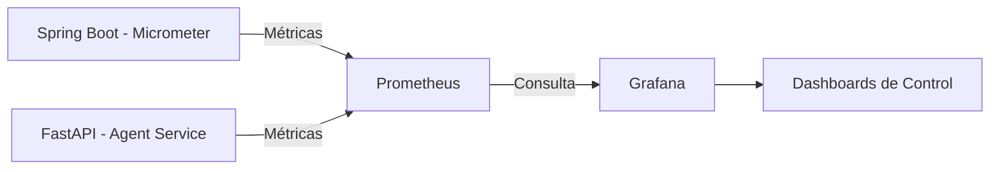

# 📊 Observabilidad y Monitoreo con Grafana y Prometheus

Para un sistema distribuido como **MUNify**, la visibilidad de lo que ocurre en cada servicio es vital. Utilizaremos el stack de **Prometheus + Grafana** para monitorear la salud del backend, el rendimiento de la IA y la experiencia del usuario.

---

## 1. Arquitectura de Monitoreo

Prometheus actuará como nuestra base de datos de series temporales, recolectando métricas (scraping) de los microservicios, mientras que Grafana será el motor de visualización.



---

## 2. Métricas Clave a Monitorear

### 🤖 Rendimiento de Agentes IA (FastAPI + LangGraph)
*   **Token Usage:** Seguimiento del consumo de tokens en NVIDIA NIM para controlar costos.
*   **Agent Latency:** Tiempo que tarda cada agente (Investigador, Librero, Redactor) en completar su tarea.
*   **Validation Failures:** Cuántas veces el Agente Validador rechaza un documento y obliga a una re-generación.
*   **Tool Success Rate:** % de éxito en las llamadas a Tavily y NotebookLM.

### ⚙️ Salud del Backend (Spring Boot)
*   **Request Latency:** Tiempo de respuesta de los endpoints de la API.
*   **WebSocket Connections:** Número de delegados conectados simultáneamente por comité.
*   **DB Pool Health:** Rendimiento de las consultas a Supabase y Pgvector.
*   **Error Rate (HTTP 5xx):** Detección temprana de caídas en el servicio.

---

## 3. Dashboards en Grafana

Diseñaremos tres paneles principales:

1.  **Dashboard Operativo (SRE):** Estado de los contenedores Docker, uso de CPU/RAM de los nodos distribuidos y latencia de red.
2.  **Dashboard de IA (Analytics):** Visualización del "Grafo de Agentes". Permite ver dónde está el cuello de botella en la generación de documentos.
3.  **Dashboard de Simulación (Business):** Número de documentos creados, total de votos emitidos en tiempo real y actividad por país.

---

## 4. Configuración Local (Docker)

En nuestro entorno `localhost`, añadiremos estos servicios al `docker-compose.yml`:

```yaml
  prometheus:
    image: prom/prometheus
    volumes:
      - ./config/prometheus.yml:/etc/prometheus/prometheus.yml
    ports:
      - "9090:9090"

  grafana:
    image: grafana/grafana
    ports:
      - "3000:3000"
    environment:
      - GF_SECURITY_ADMIN_PASSWORD=admin
```

---

## 5. Alertas e Inteligencia
Configuraremos **Grafana Alerting** para notificar (vía Discord/Slack/Email) si:
*   La API de NVIDIA NIM devuelve muchos errores 429 (Rate Limit).
*   La latencia de generación de un documento supera los 60 segundos.
*   Supabase se queda sin conexiones disponibles en el pool.
